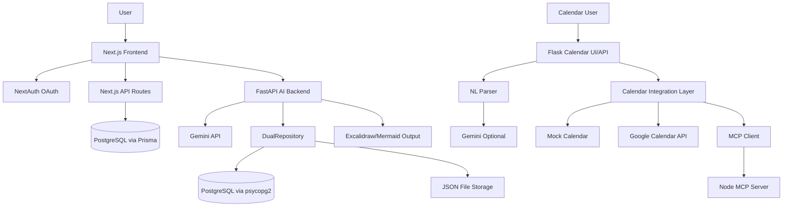

# Living Documentation: Workspace SDLC Synthesis (MVP)
**Workspace analyzed:** `google-calendar-mcp`  
**Analysis date:** 2026-04-23  
**Documentation status:** Draft living document synthesized from source code, configs, tests, notes, and existing repo docs.

## 0. Executive Summary
This workspace currently contains **two overlapping product tracks**:

1. **Blueprint Hub / SDLC Hub**
   - A monorepo for AI-assisted software specification and architecture artifact management.
   - Main stack: `frontend/` Next.js + Prisma + NextAuth, `backend/` FastAPI + Gemini + JSON/PostgreSQL dual storage.
   - This appears to be the **dominant and more actively documented product direction**.

2. **Calendar Agent System**
   - A Python-based recurring event/calendar assistant with mock, Google Calendar API, and MCP integrations.
   - Main stack: `python/` Flask web UI + rule-based/NL parsing + optional Gemini + MCP bridge.
   - This appears to be a **separate prototype/subproject**, but it still lives in the same workspace and should be treated as an active architectural concern.

Because of this, the workspace currently behaves more like a **multi-project repository** than a single cohesive product. That is the most important architectural/business ambiguity to resolve.

---

# 1. Business / Planning

## 1.1 Observed Project Purpose
### Blueprint Hub track
Based on `README.md`, `docs/FEATURE_ROADMAP.md`, `docs/API_CONTRACTS.md`, Prisma schema, and UI code, the intended purpose is:

- Turn unstructured ideas into structured software requirements/specifications using AI.
- Store, publish, browse, and review software blueprints/specs.
- Support architects, product teams, and developers with requirements and architecture artifacts.
- Add process visualization via Mermaid/Excalidraw.
- Evolve toward broader SDLC support such as versioning, contribution workflows, and traceability.

### Calendar Agent track
Based on `python/README.md`, `python/main.py`, `python/app.py`, and `python/calendar_integrations.py`, the intended purpose is:

- Parse natural language or recurring scheduling intent.
- detect time conflicts,
- suggest alternative slots,
- and persist calendar events via mock, Google Calendar API, or MCP-based tooling.

## 1.2 Assumed Business Goals
### Blueprint Hub
- Reduce time from idea to structured software specification.
- Standardize early SDLC artifacts for teams.
- Enable collaboration around requirements and architecture.
- Provide AI-assisted generation plus persistent storage and publication.

### Calendar Agent
- Improve scheduling productivity.
- Provide a user-friendly front end over calendar automation.
- Demonstrate MCP-based tool orchestration for event management.

## 1.3 Product Scope Status
- Blueprint Hub: **Prototype / MVP in active development**
- Calendar Agent: **Prototype / demo-capable utility application**
- Workspace-level product strategy: **[PLACEHOLDER: decide whether this repo is one product, two products, or a migration in progress]**

## 1.4 Stakeholders / Personas Inferred
### Blueprint Hub
- Software architects
- Product managers / analysts
- Developers
- Students / learners
- Community contributors / reviewers

### Calendar Agent
- End users managing recurring schedules
- Developers experimenting with MCP and calendar automation

## 1.5 Planning Gaps
- No single authoritative product charter for the whole workspace.
- No explicit business owner or success metrics defined in code/config.
- Several docs are templates or forward-looking plans rather than current-state records.

---

# 2. Requirements

## 2.1 Core Features Found

### Blueprint Hub: implemented or partially implemented
- OAuth login with Google and GitHub via NextAuth.
- AI spec generation from free-text prompt.
- Save specs to PostgreSQL via Prisma and also JSON/PostgreSQL in backend service.
- Publish/draft state for specs.
- Browse published specs on homepage.
- View project/spec details.
- Generate Mermaid diagrams from process descriptions.
- Generate Excalidraw process visualizations.
- Edit Excalidraw diagrams in-browser and save.
- User profile and personal specs routes.
- Basic deletion and republish flows.
- Testing coverage for API routes, components, backend endpoints, and key E2E flows.

### Blueprint Hub: documented but not fully implemented
- Rich version management UI.
- Contribution/review workflows.
- Requirement traceability matrix.
- Inline spec editing beyond current generation/save flows.
- Advanced collaboration.
- Full production ops stack.

### Calendar Agent: implemented or partially implemented
- Recurring event expansion.
- Conflict detection.
- Alternative slot suggestion and scoring.
- Interactive conflict resolution.
- Flask web UI.
- NL intent parsing with Gemini fallback to rule-based parsing.
- Google Calendar OAuth integration.
- MCP server/client integration path.
- Docker-based local deployment.

## 2.2 User Roles Found / Inferred

### Explicitly represented
- `User.role` in Prisma: default `"student"` with comments suggesting `student`, `volunteer`, `business`.

### Functional roles inferred
- Authenticated user
- Spec owner
- Viewer of published specs
- Contributor/reviewer `[PLACEHOLDER: partially modeled, not fully implemented]`
- Calendar app user
- Admin/operator `[PLACEHOLDER: not explicitly implemented]`

## 2.3 Functional Requirements Inferred
### Blueprint Hub
- User can authenticate with OAuth.
- User can generate a software spec from raw idea text.
- User can save and retrieve specs.
- User can publish/unpublish specs.
- User can browse published specs.
- User can generate process diagrams.
- User can view and edit visualizations.
- User can delete their own specs.

### Calendar Agent
- User can create recurring events.
- System can detect collisions with existing events.
- System can suggest alternative times.
- User can resolve conflicts via skip/overwrite/reschedule.
- User can use mock/API/MCP calendar backends.
- User can submit natural language scheduling commands.

## 2.4 Non-Functional Requirements Found / Implied
- Type safety in frontend.
- Validation via Pydantic/FastAPI and route validation.
- Structured persistence in PostgreSQL.
- Error handling and fallback behavior for quota/database issues.
- Automated tests and CI workflows.
- Basic caching for some routes.
- Cross-origin support for local frontend/backend integration.
- [PLACEHOLDER: formal SLAs/SLOs not actually enforced in code]

---

# 3. Architecture & Design

## 3.1 Workspace Structure
- `frontend/`: Next.js application, Prisma schema, API routes, UI components, tests.
- `backend/`: FastAPI service for AI generation and visualization logic.
- `python/`: standalone calendar/NL/MCP prototype with Flask UI.
- `docs/`: extensive documentation, plans, diagrams, test strategy, deployment templates.
- `.github/workflows/`: CI workflows.

## 3.2 Tech Stack

### Blueprint Hub
- Frontend: Next.js 16, React 19, TypeScript, Tailwind v4-style setup, Vitest, Playwright
- Auth: NextAuth v5 beta, Google/GitHub OAuth
- ORM/DB: Prisma + PostgreSQL + `pg`
- Backend API: FastAPI, Pydantic v2, uv
- AI: Google Gemini via `google-genai`
- Diagramming: Mermaid, Excalidraw
- Persistence: Prisma-managed DB plus backend dual JSON/PostgreSQL repository

### Calendar Agent
- Python 3.x
- Flask + Flask-CORS
- Optional Gemini API via REST
- Google Calendar API OAuth
- Node-based MCP server
- Docker / docker-compose

## 3.3 System Structure Summary
The Blueprint Hub track is effectively a **split application**:
- Next.js acts as both UI and internal application API.
- FastAPI acts as an auxiliary AI/diagram generation backend.
- PostgreSQL is shared conceptually, but persistence is implemented in **two different ways**:
  - Prisma in `frontend/`
  - psycopg2 + JSON dual repository in `backend/`

This creates a duplicated data-access architecture.

## 3.4 Mermaid Diagram

## 3.5 Key Architectural Observations
- The repo contains **two architectures**, not one.
- Blueprint Hub has **frontend-owned DB access** and **backend-owned DB access** simultaneously.
- Backend repository abstraction is reasonably clean, but it overlaps with Prisma’s source of truth.
- Calendar Agent follows a clearer interface-driven design with dependency injection.
- Documentation maturity is higher than architectural consolidation.

## 3.6 Design Gaps
- No single authoritative service boundary definition.
- No formal domain model ownership decision between Prisma and FastAPI repository layer.
- No explicit API gateway or service contract governance across subprojects.
- No clear workspace decomposition policy.

---

# 4. Implementation

## 4.1 Key Components Found

### Blueprint Hub frontend
- `frontend/app/page.tsx`: homepage and project browsing.
- `frontend/app/generator-test/page.tsx`: major generation/save/visualization workflow UI.
- `frontend/app/auth.ts`: NextAuth configuration.
- `frontend/app/api/*`: app-side API routes for specs, projects, diagrams, auth.
- `frontend/components/ProcessDiagramViewer.tsx`: Mermaid/Excalidraw rendering.
- `frontend/components/EditableExcalidrawCanvas.tsx`: editable visualization canvas.
- `frontend/lib/prisma.ts`: Prisma client with pooled PG adapter.
- `frontend/prisma/schema.prisma`: core domain schema.

### Blueprint Hub backend
- `backend/api.py`: FastAPI endpoints for generation and visualization.
- `backend/db.py`: repository abstraction with filesystem/PostgreSQL/dual save.
- `backend/config.py`: rate limit/storage/LLM/MCP config.
- `backend/llm_to_excalidraw.py`, `backend/excalidraw_utils.py`: visualization pipeline.

### Calendar Agent
- `python/main.py`: core calendar agent logic.
- `python/app.py`: Flask web/API layer.
- `python/nl_agent.py`: NL parsing with Gemini + rule-based fallback.
- `python/calendar_integrations.py`: mock/API/MCP adapters.
- `python/mcp_client.py`: Python MCP JSON-RPC client.
- `python/mcp-server/server.js`: Node MCP server.

## 4.2 Coding Patterns Used
- Repository pattern in backend.
- Interface/abstraction for calendar backends.
- Dependency injection in Calendar Agent.
- Type-safe route handlers in Next.js.
- Pydantic request/response models in FastAPI.
- Fallback/mock behavior for external AI quota failures.
- Client-side state-heavy React orchestration for generation workflow.
- JSON file snapshots/backups for specs/diagrams.

## 4.3 Data Model Highlights
### Blueprint Hub domain entities
- `User`
- `Account`, `Session`, `VerificationToken`
- `Project`
- `Version`
- `Artifact`
- `ProjectSpec`
- `DiagramGenerationLog`
- `Implementation`
- `Reference`
- `Contribution`

This schema suggests a broader product vision than the current UI fully exposes.

## 4.4 Implementation Risks / Debt
- Duplicate persistence logic between frontend Prisma and backend psycopg2 layer.
- Some CI steps use `|| true`, which weakens enforcement.
- Docs sometimes reference planned production setups not reflected in code.
- Large generator page indicates UI orchestration complexity and likely maintainability risk.
- Mixed naming/history indicates repository evolution or rebranding in progress.

---

# 5. Testing

## 5.1 Tests Found
### Frontend
- Vitest unit/API/component tests:
  - `frontend/app/api.test.ts`
  - component tests for `ProjectCard`, `Navbar`, `ArtifactViewer`, `ProcessDiagramViewer`
  - utility tests such as `diagramHelpers.test.ts`
- Playwright E2E:
  - `frontend/tests/e2e/generator-test.spec.ts`
  - `frontend/tests/e2e/auth-flow.spec.ts`

### Backend
- Pytest API and structure tests:
  - `backend/tests/test_api_routes.py`
  - `backend/tests/test_backend_structure.py`
  - several visualization-related tests in `backend/`

### Calendar Agent
- `python/test_main.py`
- `python/test_google_calendar.py`
- `python/test_nl_agent.py`

## 5.2 CI/CD Testing
Workflows found:
- `.github/workflows/frontend.yml`
- `.github/workflows/backend.yml`
- `.github/workflows/test.yml`

Observed:
- Combined test suite exists.
- Coverage upload is configured.
- Some jobs allow failure using `|| true`, so not all quality gates are strict.

## 5.3 Current Testing Posture
- Better than average for a prototype.
- Strongest coverage appears around core API routes and main generation flows.
- E2E relies heavily on mocked routes rather than full integrated environment.
- Performance, security, and production resilience tests are mostly documented as strategy, not fully operationalized.

## 5.4 Standard Strategies to Apply
- Enforce failing CI on lint/type/test errors consistently.
- Add contract tests between Next.js API routes and FastAPI.
- Add integration tests against one authoritative persistence layer.
- Add auth/authorization negative-path tests.
- Add migration tests around Prisma schema changes.
- Add load/performance tests only after service boundaries are stabilized.

---

# 6. Deployment

## 6.1 How It Seems to Run Today

### Blueprint Hub local dev
- Frontend: `cd frontend && bun run dev`
- Backend: `cd backend && uv run python app.py`
- Database: PostgreSQL, Prisma migrations from frontend
- FastAPI expected at `http://localhost:8000`
- Next.js expected at `http://localhost:3000`

### Calendar Agent local dev
- CLI: `python/main.py`
- Flask UI/API: `python/app.py`
- Docker: `python/docker-compose.yml`
- Optional MCP server: `python/mcp-server/server.js`

## 6.2 Deployment Intent Found in Docs
- Frontend intended for Vercel.
- Backend intended for Railway.
- Database intended for PostgreSQL/Supabase/Railway.
- Calendar app has Docker-oriented deployment path.

## 6.3 Deployment Reality Assessment
- Local/dev workflows are concrete.
- Production deployment docs are mostly templates or future-state guidance.
- No single workspace deployment architecture is finalized.

## 6.4 Deployment Gaps
- [PLACEHOLDER: canonical production topology]
- [PLACEHOLDER: environment variable inventory by service]
- [PLACEHOLDER: source-of-truth deployment target per subproject]
- [PLACEHOLDER: whether Calendar Agent is deployed at all]

---

# 7. Maintenance

## 7.1 Logging / Observability Found
- Extensive `print` / console logging in Python services.
- Frontend route and page error logging via `console.error`.
- Docs describe observability plans, but production-grade telemetry stack is not implemented in code.
- Some health endpoints exist:
  - FastAPI `/api/health`
  - Flask `/api/health`

## 7.2 Error Handling Found
### Blueprint Hub
- FastAPI uses `HTTPException`, structured error payloads, and quota fallbacks.
- Next.js API routes handle Prisma connection errors and return `503` in some cases.
- Frontend shows fallback states and user messaging around generation/storage failures.

### Calendar Agent
- Flask endpoints return JSON success/error envelopes.
- NL parsing falls back from Gemini to rule-based parsing.
- backend mode switching includes fallback to mock mode.

## 7.3 Operational Maturity
- Good prototype-level resilience patterns:
  - mock fallbacks
  - graceful route errors
  - health endpoints
  - test coverage
- Limited production-grade maintenance posture:
  - no actual centralized log pipeline
  - no implemented incident automation
  - no enforced SLOs
  - no unified backup/restore policy across whole workspace

## 7.4 Maintenance Gaps
- No single operational owner defined.
- No release/versioning strategy for the workspace as a whole.
- No documented deprecation/migration plan between old/new subprojects.
- No clear retention policy for JSON backups and generated artifacts.

---

# 8. Current-State Assessment

## 8.1 What Is Strong
- Rich documentation footprint.
- Meaningful automated tests.
- Clear product ambition in Blueprint Hub.
- Good experimentation velocity.
- Calendar Agent demonstrates solid interface-driven design and fallback strategy.

## 8.2 What Is Unclear or Risky
- Workspace identity is ambiguous.
- Persistence ownership is duplicated.
- Some docs are aspirational rather than factual.
- Production architecture is not yet normalized.
- Multiple prototypes coexist without explicit governance.

---

# 9. Recommended MVP Baseline Interpretation
If this workspace is being treated as one MVP, the most realistic MVP is:

- **Primary product:** Blueprint Hub
- **Supporting/experimental subproject:** Calendar Agent / MCP prototype
- **MVP deliverable:** authenticated AI-assisted spec generation, storage, publication, and basic process visualization
- **Non-MVP or future scope:** traceability, collaboration, enterprise ops, deep versioning, full MCP platform strategy

If that is not the intended direction, the repository should be split or re-chartered.

---

# TODO Task List
The following decisions need to be defined manually to bring this workspace up to standard software engineering practice:

1. Decide whether this repository is:
   - one product with multiple modules,
   - two separate products,
   - or a migration repo containing legacy and new systems.

2. Declare the **primary product name and scope**.
   - Current evidence conflicts between `google-calendar-mcp`, `Blueprint Hub`, `SDLC Hub`, and older naming.

3. Choose the **authoritative persistence layer** for Blueprint Hub.
   - `frontend/Prisma` vs `backend/db.py` dual repository must have one clear owner.

4. Define the **service boundary** between Next.js and FastAPI.
   - What logic belongs in frontend API routes?
   - What logic must stay in Python backend?

5. Decide whether the Calendar Agent is:
   - an internal prototype,
   - a separate shipped product,
   - or a feature to integrate into the main platform.

6. Define formal **user roles and permissions**.
   - Current schema and UI imply roles, but authorization policy is incomplete.

7. Approve the **canonical domain model**.
   - The Prisma schema is broader than the implemented UI; decide which entities are MVP and which are future backlog.

8. Define the **source of truth for requirements and architecture artifacts**.
   - Are JSON backups archival only, or first-class storage?

9. Establish **release criteria** for MVP.
   - Minimum feature set, test thresholds, deployment targets, and go-live conditions.

10. Finalize **production deployment architecture**.
   - Which services deploy where, with which environments, secrets, domains, and monitoring stack.

11. Define **observability and incident ownership**.
   - Logging, alerting, backup validation, and on-call responsibilities are not yet operationally grounded.

12. Remove or explicitly mark **template/future-state docs** that should not be treated as current truth.

13. Decide the **CI quality gate policy**.
   - Several workflows currently permit failure; define whether lint/type/test must block merges.

14. Create a single **architecture decision record set (ADRs)** for:
   - repo structure,
   - data ownership,
   - AI provider strategy,
   - diagram generation approach,
   - and MCP integration strategy.

15. Appoint explicit owners for:
   - product,
   - architecture,
   - backend,
   - frontend,
   - database,
   - operations,
   - and documentation upkeep.
