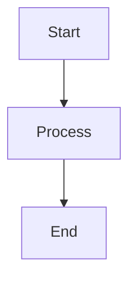
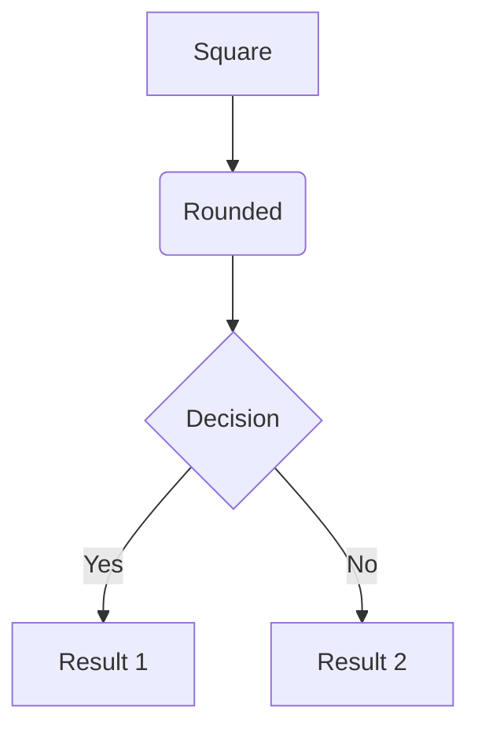
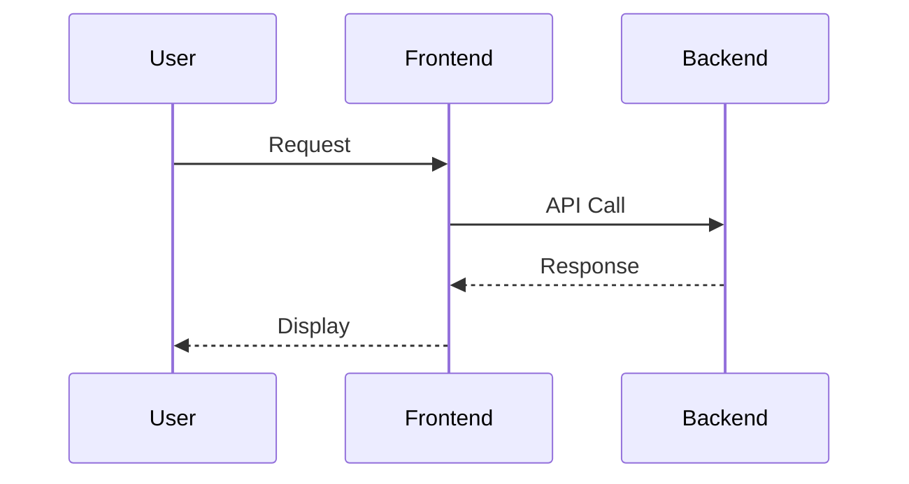
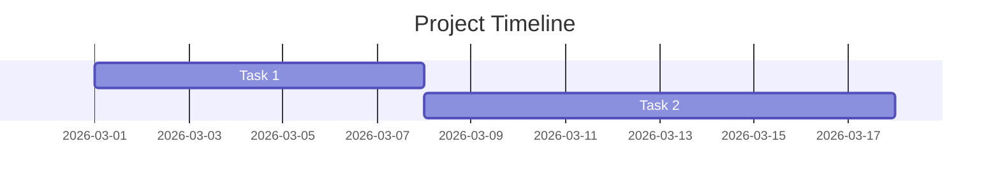
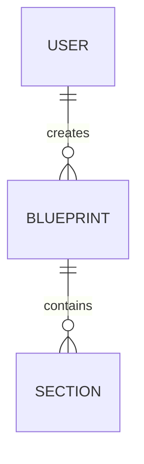

# 📊 Blueprint Hub Diagrams

This folder contains visual documentation explaining Blueprint Hub's architecture, flows, and design.

All diagrams use **Mermaid.js** syntax, which renders automatically on GitHub and in supported markdown viewers.

---

## 📂 Diagram Catalog

| Diagram | Purpose | Audience | File |
|---------|---------|----------|------|
| **System Architecture** | High-level component overview | All | [architecture.md](architecture.md) |
| **Data Flow** | How data moves through system | Developers, Architects | [data-flow.md](data-flow.md) |
| **User Journey** | User experience across personas | PM, UX, Stakeholders | [user-journey.md](user-journey.md) |
| **MCP Integration** | Future MCP architecture | Developers, Architects | [mcp-integration.md](mcp-integration.md) |
| **Deployment** | Infrastructure & DevOps | DevOps, SRE | [deployment.md](deployment.md) |

---

## 🎯 Quick Access by Role

### **For Product Managers**
1. [User Journey](user-journey.md) - Understanding user needs
2. [System Architecture](architecture.md) - High-level overview
3. [MCP Integration](mcp-integration.md) - Future capabilities

### **For Developers**
1. [System Architecture](architecture.md) - Component relationships
2. [Data Flow](data-flow.md) - API flows, sequences
3. [MCP Integration](mcp-integration.md) - Integration patterns

### **For DevOps / SRE**
1. [Deployment](deployment.md) - Infrastructure as code
2. [System Architecture](architecture.md) - Service dependencies
3. [Data Flow](data-flow.md) - Database & cache patterns

### **For Stakeholders**
1. [User Journey](user-journey.md) - Value proposition
2. [System Architecture](architecture.md) - Technology overview
3. [MCP Integration](mcp-integration.md) - Roadmap & future

---

## 📖 Diagram Types Explained

### 1. Architecture Diagrams ([architecture.md](architecture.md))
**Shows**: System components, tech stack, deployment topology  
**Use when**: Understanding high-level design, tech decisions, or onboarding new developers

**Key diagrams**:
- Component architecture (Frontend, Backend, Database layers)
- Technology stack breakdown
- Development vs. Production environments

---

### 2. Data Flow Diagrams ([data-flow.md](data-flow.md))
**Shows**: How data moves between components, sequence of operations  
**Use when**: Implementing features, debugging issues, or optimizing performance

**Key diagrams**:
- Specification generation flow
- User authentication flow
- Blueprint save/update flow
- Multi-turn conversation flow
- Database operation flow

---

### 3. User Journey Maps ([user-journey.md](user-journey.md))
**Shows**: Step-by-step user experiences across personas  
**Use when**: Designing features, improving UX, or understanding user pain points

**Key diagrams**:
- New user onboarding
- Product manager workflow
- Developer spec consumption
- Software architect design process
- Collaborative editing

---

### 4. MCP Integration Diagrams ([mcp-integration.md](mcp-integration.md))
**Shows**: Planned Model Context Protocol integrations  
**Use when**: Planning roadmap, evaluating integrations, or architecting new features

**Key diagrams**:
- Current vs. MCP-enhanced architecture
- Integration roadmap (Gantt chart)
- Database MCP sequence
- Excalidraw MCP architecture
- GitHub MCP traceability

---

### 5. Deployment Diagrams ([deployment.md](deployment.md))
**Shows**: Infrastructure, scaling, monitoring, and DevOps strategies  
**Use when**: Deploying to production, optimizing infrastructure, or troubleshooting

**Key diagrams**:
- Development environment
- Production architecture (Vercel, Railway, Supabase)
- CI/CD pipeline
- Horizontal scaling strategy
- Monitoring & observability

---

## 🛠️ How to Use These Diagrams

### Viewing Diagrams
- **On GitHub**: Diagrams render automatically in markdown preview
- **VS Code**: Install "Markdown Preview Mermaid Support" extension
- **Local Viewer**: Use Mermaid Live Editor: https://mermaid.live/

### Editing Diagrams
1. Open the `.md` file in any text editor
2. Modify the Mermaid syntax inside ` ```mermaid ... ``` ` blocks
3. Preview changes using GitHub preview or Mermaid Live Editor
4. Commit changes to Git

### Creating New Diagrams
```markdown
## Title

Description of what the diagram shows.



Explanation of the diagram.
```

---

## 📚 Mermaid Syntax Quick Reference

### Graph/Flowchart


### Sequence Diagram


### Gantt Chart


### Entity Relationship


**Full Reference**: https://mermaid.js.org/intro/

---

## 🔄 Diagram Maintenance

### Update Frequency
- **Architecture**: Update on major tech stack changes
- **Data Flow**: Update when adding new features or endpoints
- **User Journey**: Update based on UX research or user feedback
- **MCP Integration**: Update quarterly (roadmap review)
- **Deployment**: Update when changing infrastructure

### Review Schedule
- **Monthly**: Check for outdated diagrams
- **Quarterly**: Full diagram audit
- **On Release**: Update relevant diagrams

---

## 🤝 Contributing Diagrams

### Creating a New Diagram

1. **Identify the need**: What does this diagram explain?
2. **Choose diagram type**: Architecture, flow, journey, etc.
3. **Create markdown file**: `docs/diagrams/your-diagram.md`
4. **Use Mermaid syntax**: See quick reference above
5. **Add to this README**: Update the catalog table
6. **Commit & PR**: Follow [CONTRIBUTING.md](../../CONTRIBUTING.md)

### Diagram Quality Guidelines

✅ **Do**:
- Keep diagrams simple and focused
- Use consistent colors (see existing diagrams for palette)
- Add descriptive titles and legends
- Include explanatory text below diagrams
- Use standard notation (UML, C4, etc.)

❌ **Don't**:
- Overcrowd diagrams (split into multiple if needed)
- Use inconsistent terminology
- Skip explanations (diagrams should be self-explanatory)
- Create diagrams without a clear purpose

---

## 📞 Questions or Suggestions?

- **Diagram unclear?** Open an issue: [GitHub Issues](https://github.com/special_project_v1/issues)
- **Need a new diagram?** Request via feature request template
- **Found an error?** Submit a PR with corrections

---

**Last Updated**: March 2, 2026  
**Maintainer**: Development Team
