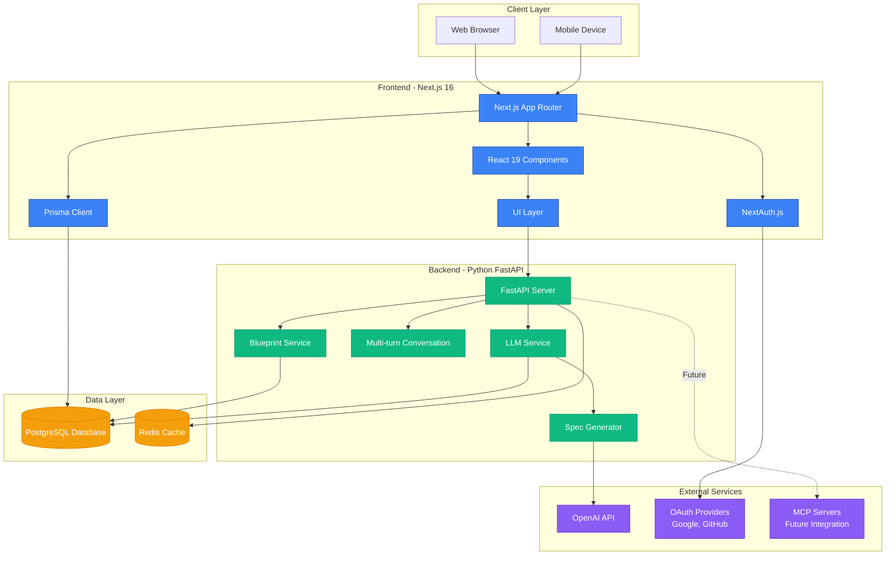
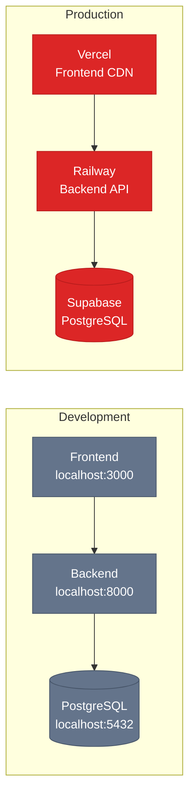

# Blueprint Hub - System Architecture Diagram

High-level system architecture showing all major components and their relationships.

## Architecture Overview

## Component Details

### Frontend Layer
- **Next.js App Router**: Server-side rendering, routing, API routes
- **React Components**: Reusable UI elements (Navbar, Cards, Modals)
- **NextAuth.js**: OAuth authentication (Google, GitHub)
- **Prisma Client**: Type-safe database access

### Backend Layer
- **FastAPI Server**: RESTful API endpoints
- **LLM Service**: OpenAI integration for spec generation
- **Spec Generator**: Transforms prompts → structured specifications
- **Multi-turn Conversation**: Context-aware follow-up generation
- **Blueprint Service**: CRUD operations for blueprints

### Data Layer
- **PostgreSQL**: Primary database (blueprints, users, sections)
- **Redis**: Session cache, rate limiting (future)

### External Services
- **OpenAI API**: GPT-4 for LLM generation
- **OAuth Providers**: Google + GitHub authentication
- **MCP Servers**: Future integrations (Excalidraw, GitHub, etc.)

## Technology Stack

| Layer | Technology | Version |
|-------|-----------|---------|
| **Frontend** | Next.js | 16.x |
| **Frontend** | React | 19.x |
| **Frontend** | TypeScript | 5.x |
| **Backend** | Python | 3.11+ |
| **Backend** | FastAPI | 0.110+ |
| **Database** | PostgreSQL | 14+ |
| **ORM** | Prisma | 7.x |
| **Auth** | NextAuth.js | 5.x |
| **Cache** | Redis | 7.x (future) |

## Deployment

---

**Purpose**: This diagram provides a high-level view of Blueprint Hub's architecture for developers, stakeholders, and documentation.

**Last Updated**: March 2, 2026
