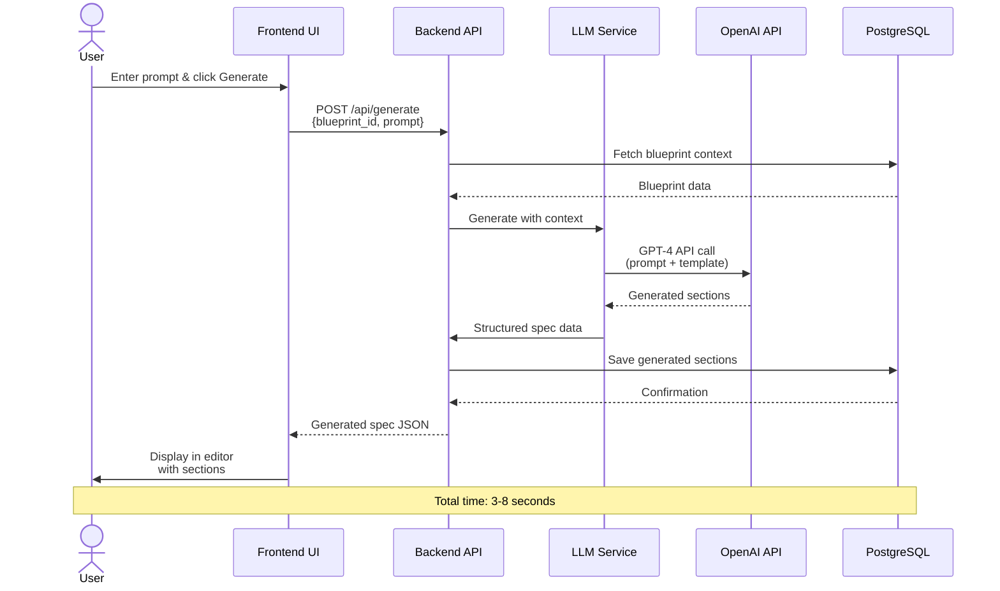
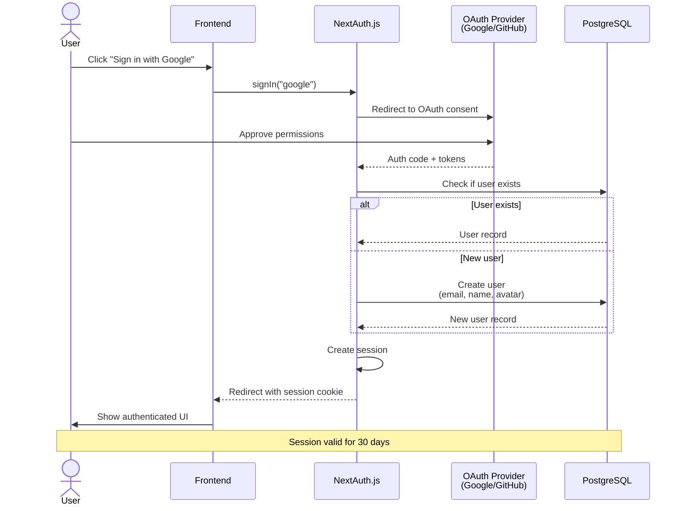
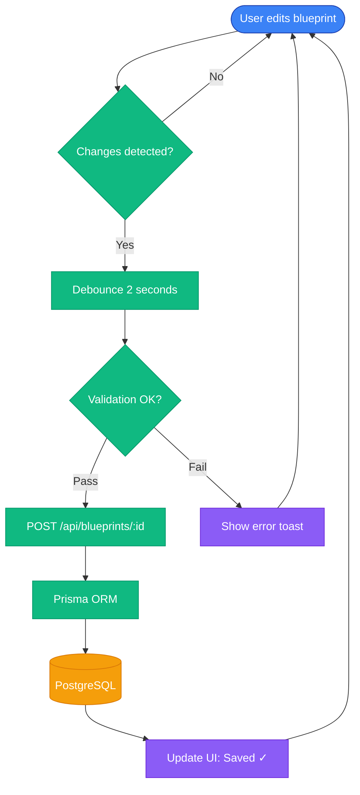
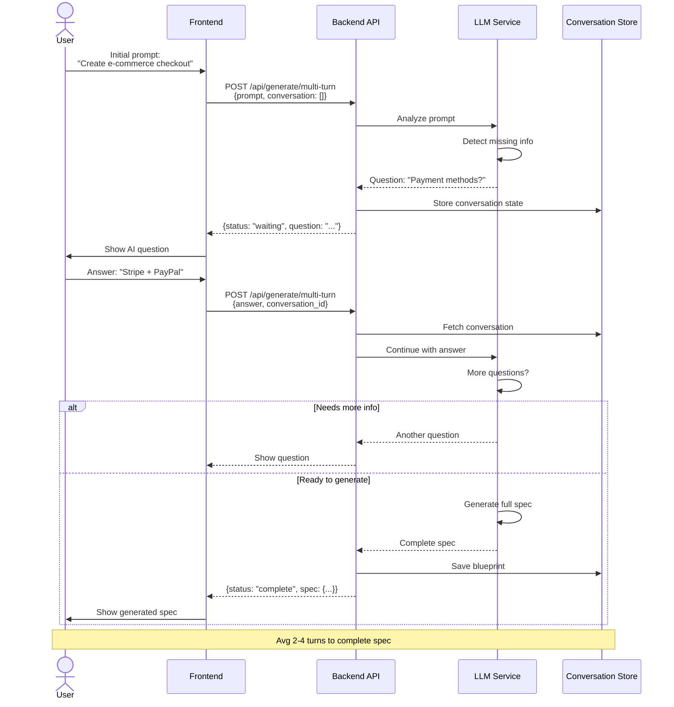
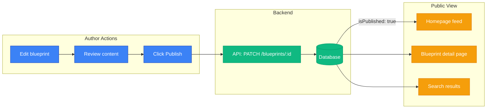
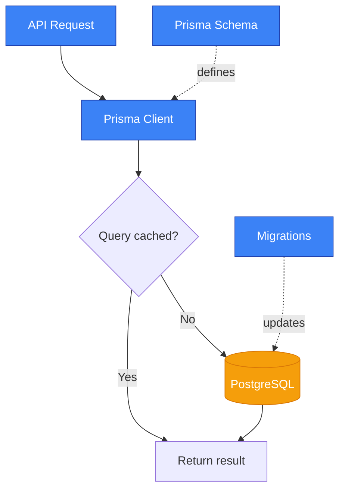
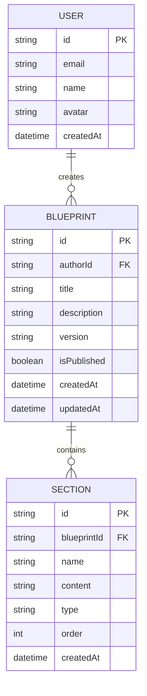

# Blueprint Hub - Data Flow Diagrams

This document shows how data flows through the system for key user operations.

---

## 1. Specification Generation Flow

Shows the complete flow from user prompt → LLM generation → saving to database.

---

## 2. User Authentication Flow

OAuth authentication using NextAuth.js with Google/GitHub.

---

## 3. Blueprint Save/Update Flow

Creating or editing a blueprint with sections.

---

## 4. Multi-turn Conversation Flow

Conversational spec generation with follow-up questions.

---

## 5. Publish & View Flow

Publishing a blueprint for public/team viewing.

---

## 6. Database Operations Flow

How Prisma ORM handles database operations.

---

## Data Model Summary

---

**Purpose**: These diagrams explain data flows for developers and stakeholders to understand system behavior.

**Last Updated**: March 2, 2026
