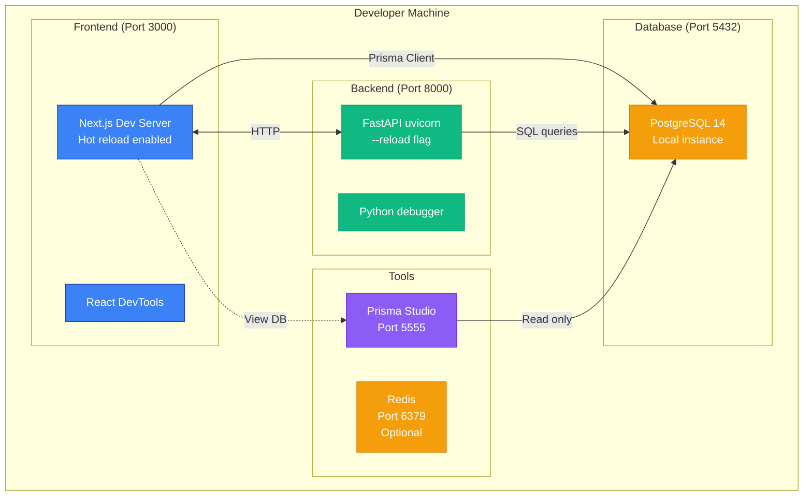
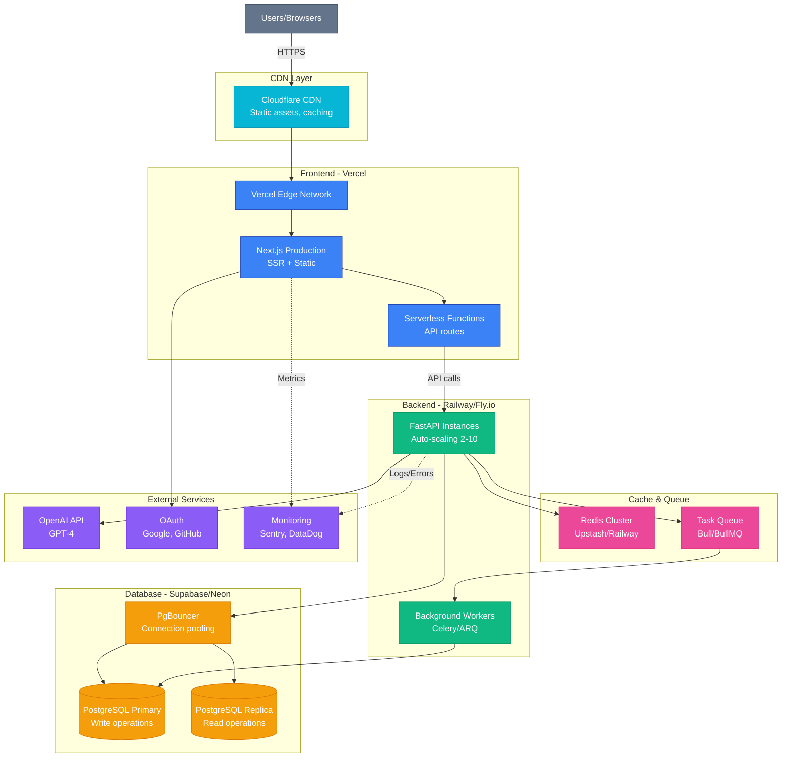
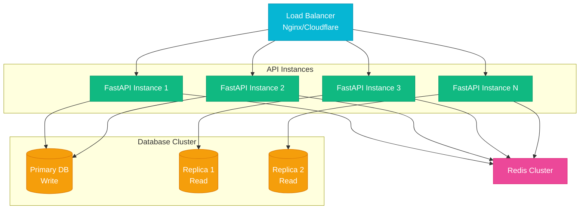
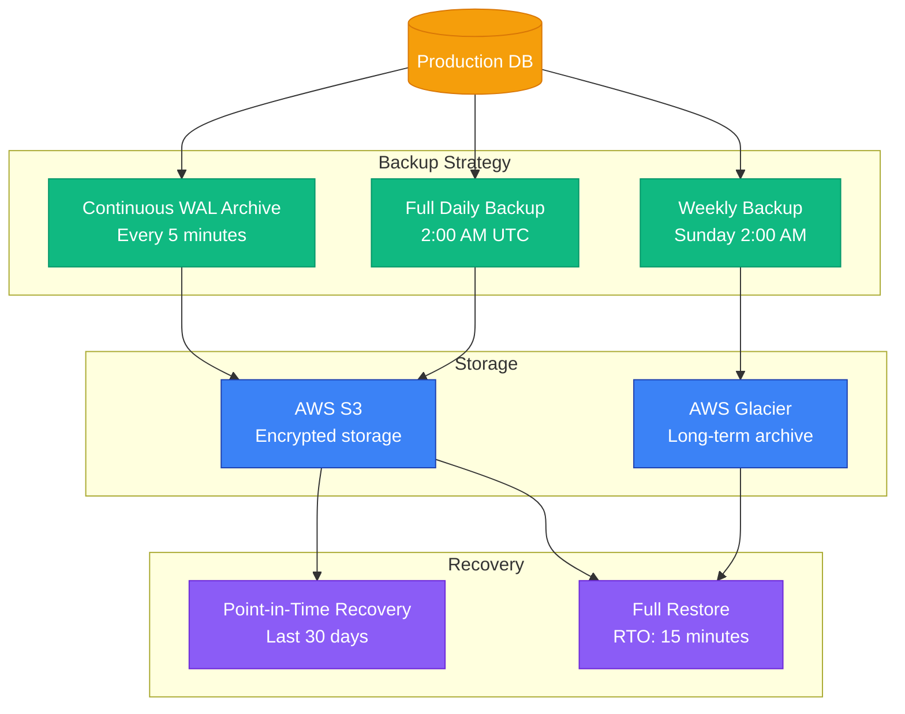
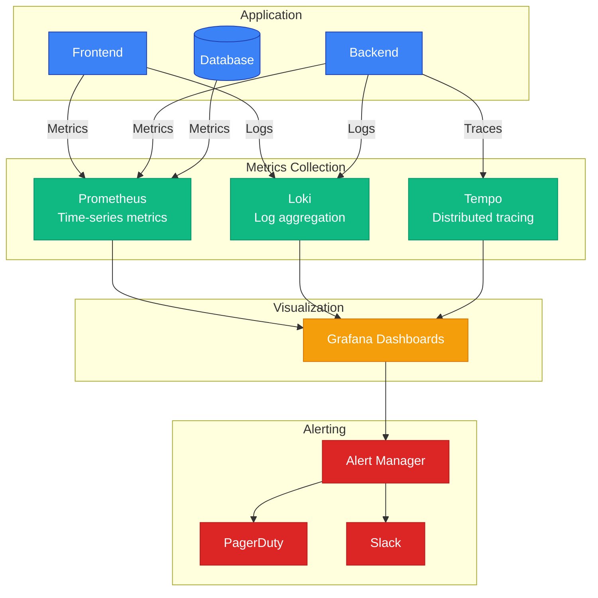
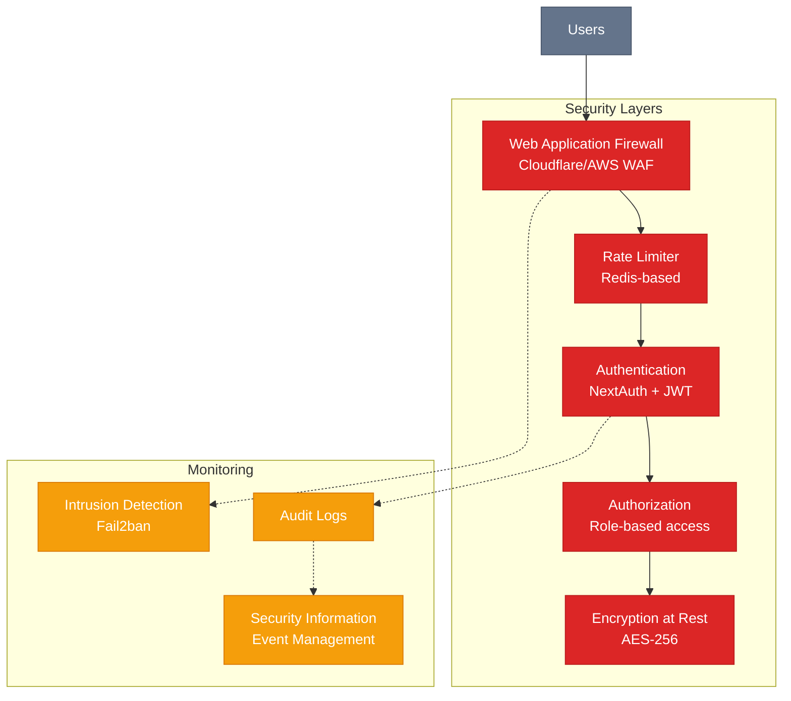

# Blueprint Hub - Deployment Architecture

This document shows deployment configurations for development, staging, and production environments.

---

## 1. Development Environment (Local)



**Setup Commands**:
```bash
# Terminal 1: Frontend
cd frontend && bun run dev

# Terminal 2: Backend
cd backend && uv run python app.py

# Terminal 3: Database UI (optional)
cd frontend && bunx prisma studio
```

---

## 2. Production Environment (Recommended)



---

## 3. Infrastructure as Code (Deployment)

### Vercel Deployment (Frontend)

```yaml
# vercel.json
{
  "buildCommand": "cd frontend && bun run build",
  "outputDirectory": "frontend/.next",
  "devCommand": "cd frontend && bun run dev",
  "framework": "nextjs",
  "regions": ["sfo1", "iad1"],
  "env": {
    "DATABASE_URL": "@database_url",
    "NEXTAUTH_SECRET": "@nextauth_secret",
    "OPENAI_API_KEY": "@openai_key"
  }
}
```

### Railway Deployment (Backend)

```toml
# railway.toml
[build]
builder = "NIXPACKS"
buildCommand = "uv sync"

[deploy]
startCommand = "uv run uvicorn api:app --host 0.0.0.0 --port $PORT"
restartPolicyType = "ON_FAILURE"
restartPolicyMaxRetries = 10

[[healthchecks]]
path = "/health"
interval = 30
timeout = 10
```

### Docker Compose (Alternative)

```yaml
# docker-compose.yml
version: '3.9'

services:
  frontend:
    build: ./frontend
    ports:
      - "3000:3000"
    environment:
      - DATABASE_URL=${DATABASE_URL}
      - NEXTAUTH_SECRET=${NEXTAUTH_SECRET}
    depends_on:
      - backend
      - postgres

  backend:
    build: ./backend
    ports:
      - "8000:8000"
    environment:
      - DATABASE_URL=${DATABASE_URL}
      - OPENAI_API_KEY=${OPENAI_API_KEY}
    depends_on:
      - postgres
      - redis

  postgres:
    image: postgres:15-alpine
    ports:
      - "5432:5432"
    environment:
      - POSTGRES_USER=blueprint_user
      - POSTGRES_PASSWORD=${DB_PASSWORD}
      - POSTGRES_DB=blueprint_hub
    volumes:
      - pg_data:/var/lib/postgresql/data

  redis:
    image: redis:7-alpine
    ports:
      - "6379:6379"
    volumes:
      - redis_data:/data

volumes:
  pg_data:
  redis_data:
```

---

## 4. CI/CD Pipeline

```mermaid
flowchart LR
    subgraph "Developer"
        CODE[Write Code]
        COMMIT[Git Commit]
        PUSH[Git Push]
    end

    subgraph "GitHub Actions"
        TRIGGER[Workflow Triggered]
        LINT[Lint & Type Check]
        TEST[Run Tests]
        BUILD[Build Artifacts]
        SECURITY[Security Scan]
    end

    subgraph "Deployment"
        STAGE{Branch?}
        DEPLOY_STAGING[Deploy to Staging]
        DEPLOY_PROD[Deploy to Production]
        HEALTH[Health Check]
    end

    subgraph "Monitoring"
        METRICS[Collect Metrics]
        ALERTS[Alert on Errors]
        ROLLBACK{Errors?}
    end

    CODE --> COMMIT
    COMMIT --> PUSH
    PUSH --> TRIGGER
    TRIGGER --> LINT
    LINT --> TEST
    TEST --> BUILD
    BUILD --> SECURITY
    SECURITY --> STAGE
    
    STAGE -->|develop| DEPLOY_STAGING
    STAGE -->|main| DEPLOY_PROD
    
    DEPLOY_STAGING --> HEALTH
    DEPLOY_PROD --> HEALTH
    HEALTH --> METRICS
    METRICS --> ALERTS
    ALERTS --> ROLLBACK
    
    ROLLBACK -->|Yes| DEPLOY_PROD
    ROLLBACK -->|No| END([Done])

    classDef dev fill:#3b82f6,stroke:#1e40af,color:#fff
    classDef ci fill:#10b981,stroke:#059669,color:#fff
    classDef deploy fill:#f59e0b,stroke:#d97706,color:#fff
    classDef monitor fill:#8b5cf6,stroke:#6d28d9,color:#fff

    class CODE,COMMIT,PUSH dev
    class TRIGGER,LINT,TEST,BUILD,SECURITY ci
    class STAGE,DEPLOY_STAGING,DEPLOY_PROD,HEALTH deploy
    class METRICS,ALERTS,ROLLBACK monitor
```



---

## 5. Scaling Strategy

### Horizontal Scaling



### Auto-scaling Rules

| Metric | Threshold | Action |
|--------|-----------|--------|
| **CPU Usage** | >70% for 5min | Scale up +1 instance |
| **Memory Usage** | >80% | Scale up +1 instance |
| **Request Queue** | >100 pending | Scale up +2 instances |
| **Error Rate** | >5% | Alert + investigate |
| **Response Time** | >2s p95 | Scale up or optimize |
| **Night Hours** | 12am-6am | Scale down to minimum |

---

## 6. Database Backup & Recovery



**Recovery Objectives**:
- **RTO** (Recovery Time Objective): 15 minutes
- **RPO** (Recovery Point Objective): 5 minutes (WAL archive)
- **Retention**: 30 days PITR, 365 days full backups

---

## 7. Monitoring & Observability



---

## 8. Security Architecture



---

## Deployment Checklist

### Pre-Deployment
- [ ] All tests passing (frontend + backend)
- [ ] Environment variables configured
- [ ] Database migrations ready
- [ ] SSL certificates valid
- [ ] DNS records configured
- [ ] Monitoring dashboards set up
- [ ] Backup strategy tested

### Deployment
- [ ] Deploy to staging first
- [ ] Run smoke tests
- [ ] Check health endpoints
- [ ] Verify database connections
- [ ] Test OAuth flows
- [ ] Load test (optional)
- [ ] Deploy to production
- [ ] Monitor metrics for 15 minutes

### Post-Deployment
- [ ] Verify all features working
- [ ] Check error rates
- [ ] Review logs for anomalies
- [ ] Update status page
- [ ] Notify team
- [ ] Document any issues

---

**Purpose**: This document provides deployment strategies for running Blueprint Hub reliably in production.

**Last Updated**: March 2, 2026
