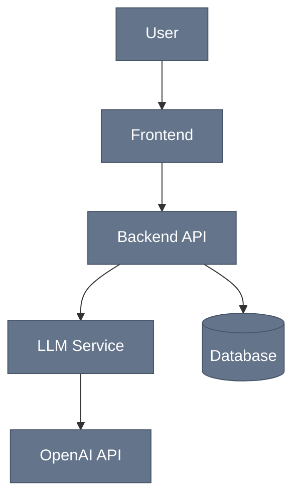
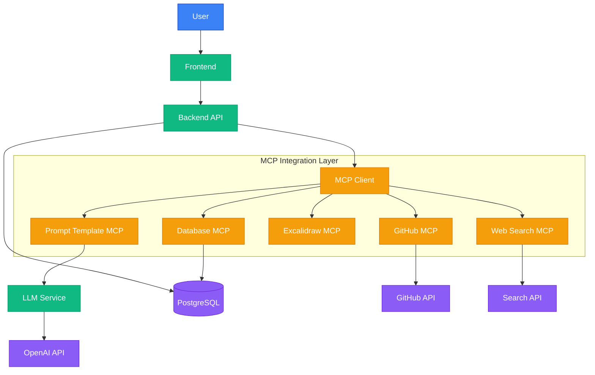
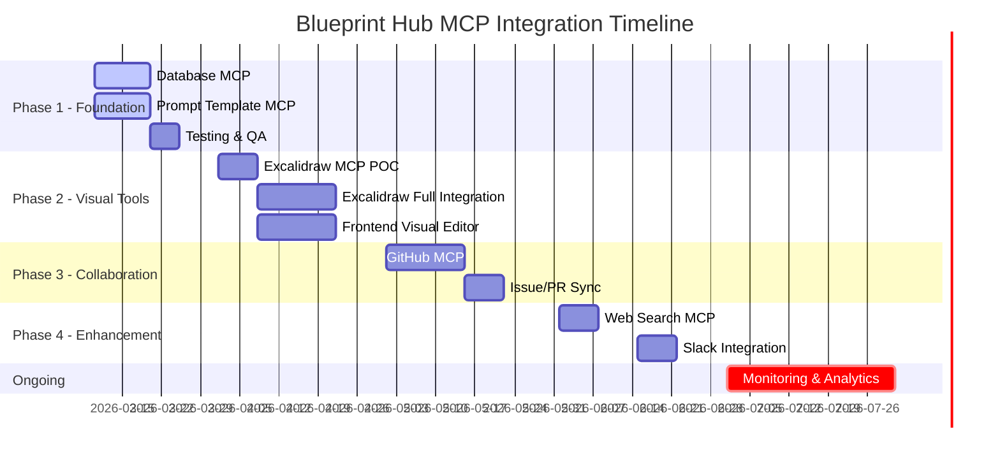
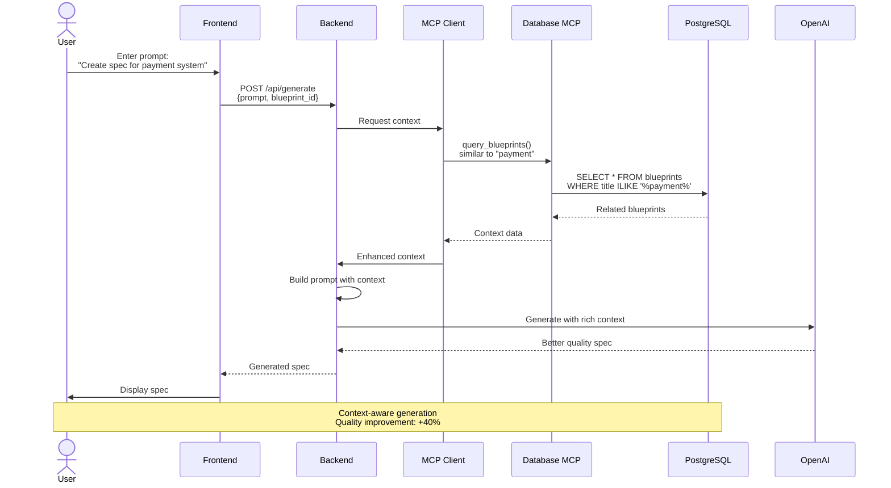
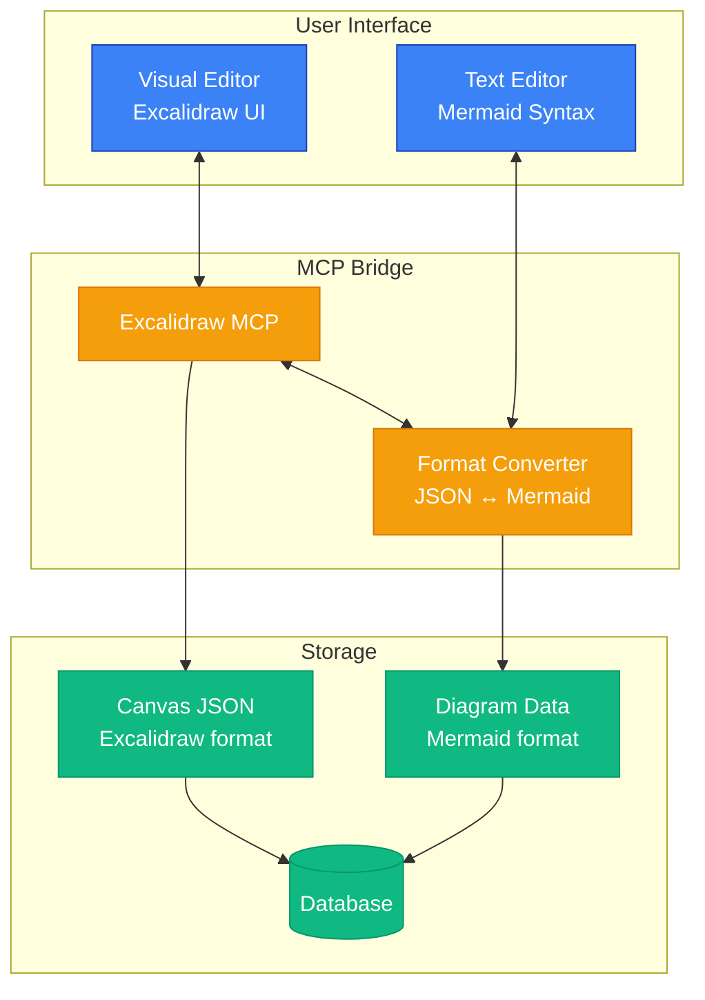
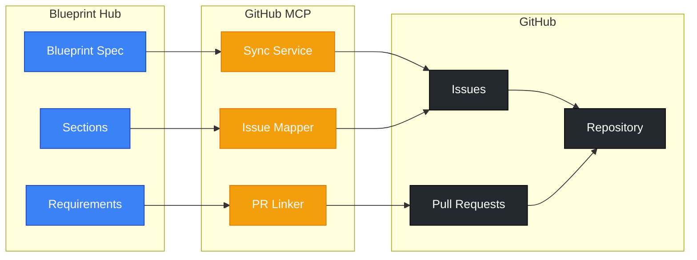
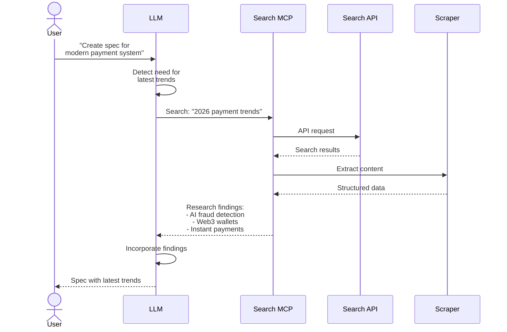
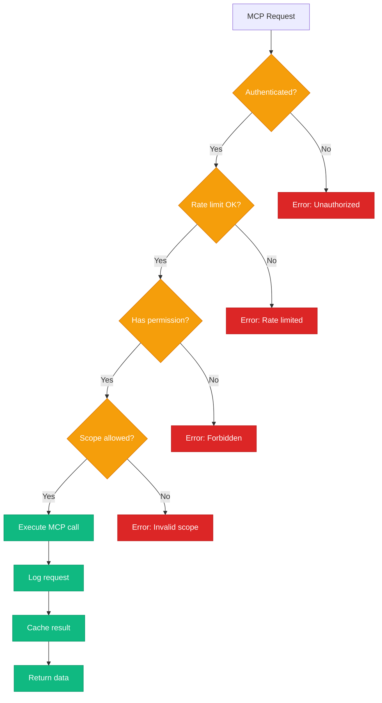

# Blueprint Hub - MCP Integration & Future Architecture

This document shows planned MCP (Model Context Protocol) integrations and their architecture.

---

## 1. Current Architecture vs. MCP-Enhanced Architecture

### Before MCP (Current State)



### After MCP (Future State - Q2-Q3 2026)



---

## 2. MCP Integration Roadmap



---

## 3. Database MCP Architecture (Phase 1)



**Benefits**:
- ✅ LLM has access to historical data
- ✅ Can reference similar specs
- ✅ Better consistency across blueprints
- ✅ Reduced hallucinations

---

## 4. Excalidraw MCP Architecture (Phase 2)



**Use Cases**:
1. **Non-technical users** draw diagrams visually
2. **Auto-convert** to Mermaid for version control
3. **Bidirectional sync** (edit in either mode)
4. **Export** to PNG/SVG for presentations

---

## 5. GitHub MCP Architecture (Phase 3)



**Traceability Flow**:
```
Requirement Section → GitHub Issue → Pull Request → Code Commit → Deployment
```

**Benefits**:
- ✅ Full traceability from spec to code
- ✅ Auto-create issues from requirements
- ✅ Link PRs back to specs
- ✅ Status sync (spec updates when issue closed)

---

## 6. Prompt Template MCP (Phase 1)

Domain-specific prompt templates for better spec generation.

```mermaid
flowchart TD
    USER_INPUT[User Input:<br/>"E-commerce checkout"]
    
    DETECT{Detect Domain}
    
    ECOM[E-commerce Template]
    SAAS[SaaS Template]
    MOBILE[Mobile App Template]
    GENERIC[Generic Template]
    
    PROMPT_BUILD[Build Enhanced Prompt]
    LLM[LLM Generation]
    SPEC[Generated Spec]

    USER_INPUT --> DETECT
    DETECT --> ECOM
    DETECT --> SAAS
    DETECT --> MOBILE
    DETECT --> GENERIC
    
    ECOM --> PROMPT_BUILD
    SAAS --> PROMPT_BUILD
    MOBILE --> PROMPT_BUILD
    GENERIC --> PROMPT_BUILD
    
    PROMPT_BUILD --> LLM
    LLM --> SPEC

    classDef input fill:#3b82f6,stroke:#1e40af,color:#fff
    classDef template fill:#f59e0b,stroke:#d97706,color:#fff
    classDef process fill:#10b981,stroke:#059669,color:#fff
    classDef output fill:#8b5cf6,stroke:#6d28d9,color:#fff

    class USER_INPUT input
    class ECOM,SAAS,MOBILE,GENERIC template
    class DETECT,PROMPT_BUILD,LLM process
    class SPEC output
```

**Template Categories**:
- **E-commerce**: Payment, cart, inventory, shipping
- **SaaS**: Subscription, billing, user management, analytics
- **Mobile**: Offline-first, push notifications, app store compliance
- **Fintech**: Security, compliance, audit trails
- **Healthcare**: HIPAA, data privacy, patient records
- **IoT**: Device management, real-time data, edge computing

---

## 7. Web Search MCP (Phase 4)

LLM can research latest technologies during generation.



---

## 8. MCP Security & Permissions



---

## MCP Implementation Checklist

### Phase 1: Foundation (Week 1-2)
- [ ] Create `backend/mcp/` folder structure
- [ ] Implement MCP client base class
- [ ] Database MCP: Read operations only
- [ ] Prompt Template MCP: Load from JSON files
- [ ] Unit tests for each MCP
- [ ] Documentation in `docs/MCP_INTEGRATION.md`

### Phase 2: Visual Tools (Week 3-6)
- [ ] Excalidraw MCP server setup
- [ ] Format converter (JSON ↔ Mermaid)
- [ ] Frontend visual editor component
- [ ] Real-time sync implementation
- [ ] Storage optimization (compression)

### Phase 3: Collaboration (Week 7-10)
- [ ] GitHub MCP OAuth flow
- [ ] Issue creation from requirements
- [ ] PR linking to specs
- [ ] Status sync webhooks
- [ ] Traceability dashboard

### Phase 4: Enhancement (Week 11+)
- [ ] Web Search MCP with rate limiting
- [ ] Slack webhook integration
- [ ] Monitoring & analytics MCP
- [ ] Performance optimization

---

**Purpose**: This document provides the technical roadmap for MCP integrations, enabling Blueprint Hub to become a best-in-class requirements platform.

**Last Updated**: March 2, 2026  
**Next Review**: April 1, 2026 (after Phase 1 completion)
