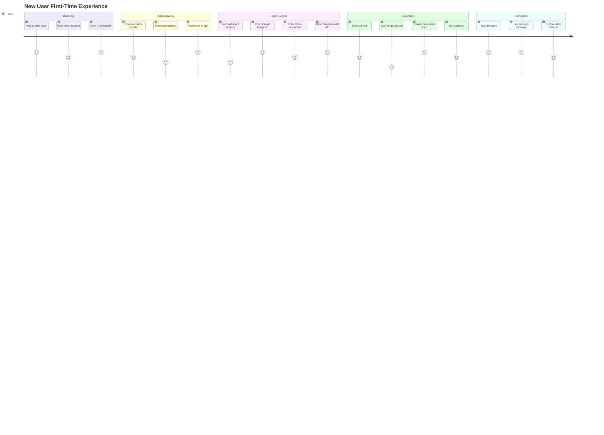
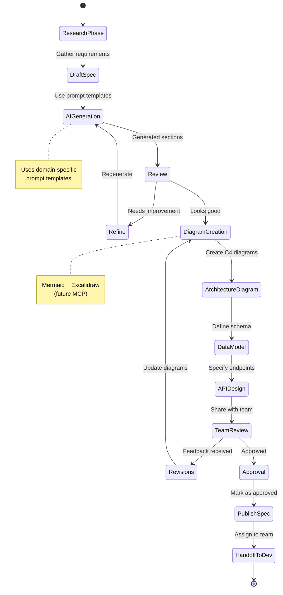
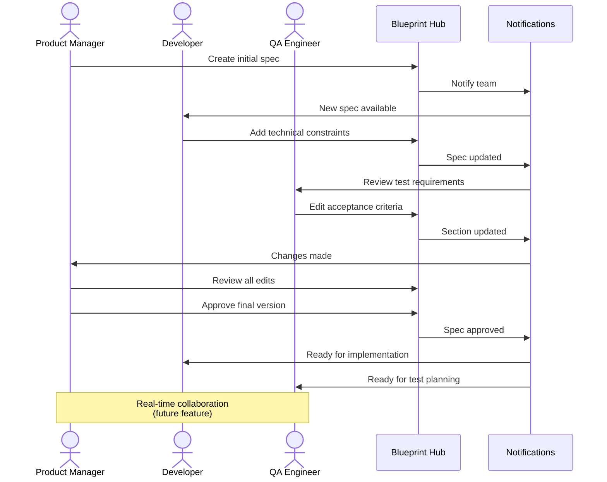
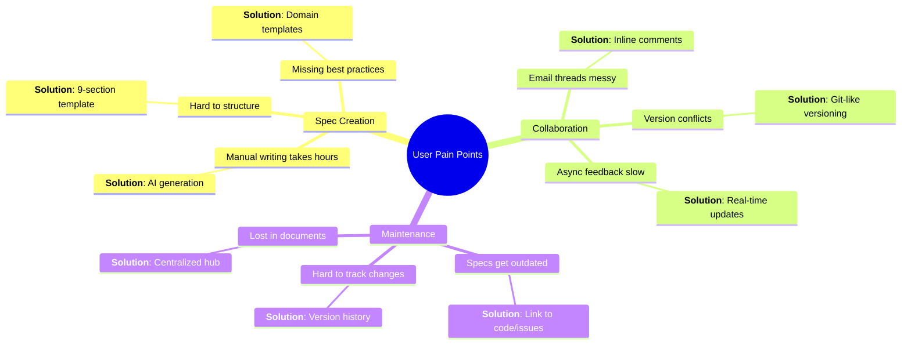

# Blueprint Hub - User Journey Diagrams

This document maps out the complete user experience for different personas and use cases.

---

## 1. New User Onboarding Journey

First-time user experience from landing to first spec generation.



**Key Moments**:
- 🎯 **Aha Moment**: Seeing AI generate complete spec from simple prompt (30 seconds)
- ⚡ **First Value**: Blueprint saved and can be edited/shared
- 🔥 **Hook**: Realizes value of structured requirements

---

## 2. Product Manager Journey

PM creating requirements for a new feature.

```mermaid
flowchart TD
    START([PM needs to spec new feature])
    LOGIN{Logged in?}
    AUTH[Sign in with Google]
    DASH[Dashboard]
    CREATE[Create new blueprint]
    
    PROMPT[Enter feature prompt:<br/>"Mobile payment integration"]
    GEN[AI generates 9 sections]
    REVIEW{Spec complete?}
    EDIT[Edit specific sections]
    DIAGRAM[Add Mermaid diagrams]
    
    COLLABORATE{Need team input?}
    SHARE[Share with team]
    FEEDBACK[Collect feedback]
    REVISE[Revise spec]
    
    PUBLISH[Publish blueprint]
    EXPORT[Export to GitHub/Jira]
    DONE([Feature spec ready!])

    START --> LOGIN
    LOGIN -->|No| AUTH
    LOGIN -->|Yes| DASH
    AUTH --> DASH
    DASH --> CREATE
    CREATE --> PROMPT
    PROMPT --> GEN
    GEN --> REVIEW
    REVIEW -->|No| EDIT
    EDIT --> DIAGRAM
    DIAGRAM --> REVIEW
    REVIEW -->|Yes| COLLABORATE
    COLLABORATE -->|Yes| SHARE
    SHARE --> FEEDBACK
    FEEDBACK --> REVISE
    REVISE --> PUBLISH
    COLLABORATE -->|No| PUBLISH
    PUBLISH --> EXPORT
    EXPORT --> DONE

    classDef start fill:#3b82f6,stroke:#1e40af,color:#fff
    classDef process fill:#10b981,stroke:#059669,color:#fff
    classDef decision fill:#f59e0b,stroke:#d97706,color:#fff
    classDef end fill:#8b5cf6,stroke:#6d28d9,color:#fff

    class START,DONE start
    class LOGIN,REVIEW,COLLABORATE decision
    class AUTH,DASH,CREATE,PROMPT,GEN,EDIT,DIAGRAM,SHARE,FEEDBACK,REVISE,PUBLISH,EXPORT process
```

**Timeline**: 15-30 minutes from idea to published spec

---

## 3. Developer Journey

Developer consuming specs and implementing features.

```mermaid
flowchart LR
    subgraph "Discovery"
        ASSIGN[Assigned ticket]
        LINK[Click spec link]
        VIEW[View blueprint]
    end

    subgraph "Understanding"
        READ[Read sections]
        DIAGRAM_VIEW[View diagrams]
        REQUIREMENTS[Note requirements]
        QUESTIONS{Questions?}
        COMMENT[Comment on spec]
    end

    subgraph "Implementation"
        CODE[Write code]
        TEST[Run tests]
        PR[Create PR]
        LINK_SPEC[Link to blueprint]
    end

    subgraph "Completion"
        REVIEW_PR[Code review]
        MERGE[Merge to main]
        UPDATE[Update blueprint status]
    end

    ASSIGN --> LINK
    LINK --> VIEW
    VIEW --> READ
    READ --> DIAGRAM_VIEW
    DIAGRAM_VIEW --> REQUIREMENTS
    REQUIREMENTS --> QUESTIONS
    QUESTIONS -->|Yes| COMMENT
    QUESTIONS -->|No| CODE
    COMMENT --> CODE
    CODE --> TEST
    TEST --> PR
    PR --> LINK_SPEC
    LINK_SPEC --> REVIEW_PR
    REVIEW_PR --> MERGE
    MERGE --> UPDATE

    classDef discover fill:#3b82f6,stroke:#1e40af,color:#fff
    classDef understand fill:#10b981,stroke:#059669,color:#fff
    classDef implement fill:#f59e0b,stroke:#d97706,color:#fff
    classDef complete fill:#8b5cf6,stroke:#6d28d9,color:#fff

    class ASSIGN,LINK,VIEW discover
    class READ,DIAGRAM_VIEW,REQUIREMENTS,QUESTIONS,COMMENT understand
    class CODE,TEST,PR,LINK_SPEC implement
    class REVIEW_PR,MERGE,UPDATE complete
```



---

## 4. Architect Journey

Software architect designing system specifications.



**Typical Duration**: 2-4 hours for complete system design spec

---

## 5. Collaborative Editing Journey

Multiple team members working on the same spec.



---

## 6. Visitor Journey (Public Blueprint)

Non-authenticated user browsing published specs.

```mermaid
flowchart TD
    GOOGLE[Google search:<br/>"e-commerce requirements"]
    RESULT[Blueprint Hub result]
    LAND[Landing on public spec]
    
    READ[Read specification]
    EXPLORE[Explore sections]
    DIAGRAMS[View diagrams]
    
    IMPRESSED{Useful?}
    SIGNUP[Sign up to create own]
    SHARE[Share link]
    LEAVE[Leave site]
    
    GOOGLE --> RESULT
    RESULT --> LAND
    LAND --> READ
    READ --> EXPLORE
    EXPLORE --> DIAGRAMS
    DIAGRAMS --> IMPRESSED
    
    IMPRESSED -->|Yes| SIGNUP
    IMPRESSED -->|Neutral| SHARE
    IMPRESSED -->|No| LEAVE
    
    SIGNUP --> DASH[Dashboard]
    SHARE --> SOCIAL[Social media]

    classDef external fill:#64748b,stroke:#475569,color:#fff
    classDef engage fill:#3b82f6,stroke:#1e40af,color:#fff
    classDef convert fill:#10b981,stroke:#059669,color:#fff

    class GOOGLE,RESULT external
    class LAND,READ,EXPLORE,DIAGRAMS,SHARE engage
    class SIGNUP,DASH convert
```

---

## User Persona Summary

| Persona | Primary Goal | Key Journey | Success Metric |
|---------|-------------|-------------|----------------|
| **Product Manager** | Create feature specs | Prompt → Generate → Collaborate → Publish | Time to spec: <30min |
| **Software Architect** | Design system architecture | Research → Draft → Diagram → Approve | Spec completeness: 90%+ |
| **Developer** | Implement from spec | View → Understand → Code → Link PR | Clarity rating: 4.5/5 |
| **QA Engineer** | Define test criteria | Review → Edit acceptance criteria → Approve | Testable requirements: 100% |
| **Stakeholder** | Review progress | Browse → Read → Comment → Approve | Approval time: <2 days |
| **Visitor** | Find reference specs | Search → Read → Learn | Conversion rate: 15% |

---

## Pain Points & Solutions



---

**Purpose**: These journeys help design features that match real user workflows and pain points.

**Last Updated**: March 2, 2026
